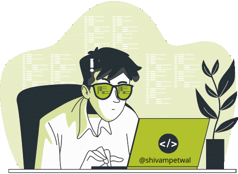

 

<h1 align="left">Hello World!  I'm Shivam Petwal</h1>

###

I'm currently a student pursuing my MCA (Master of Computer Application) 👨‍🎓 from Graphic Era Hill University , Dehradun , Uttarakhand, India

###

<h2 align="left">Languages and Tools</h2>

###

 

###

  
  
  
  
  
  
  
  
  
  
  
  
  
  
  
  
  
  
  
  
  
  
  
  
  
  
  
  
  
  
  
  
  
  
  
  
  
  
  
  
  
  
  
  
  

###

 

<h2 align="left">Shivam Petwal's GitHub stats</h2>

###

 

###

 

  
  
  

###

<h2 align="left">Accounts</h2>

###

 

  
  
  
  
  
  
  

###

  

###
